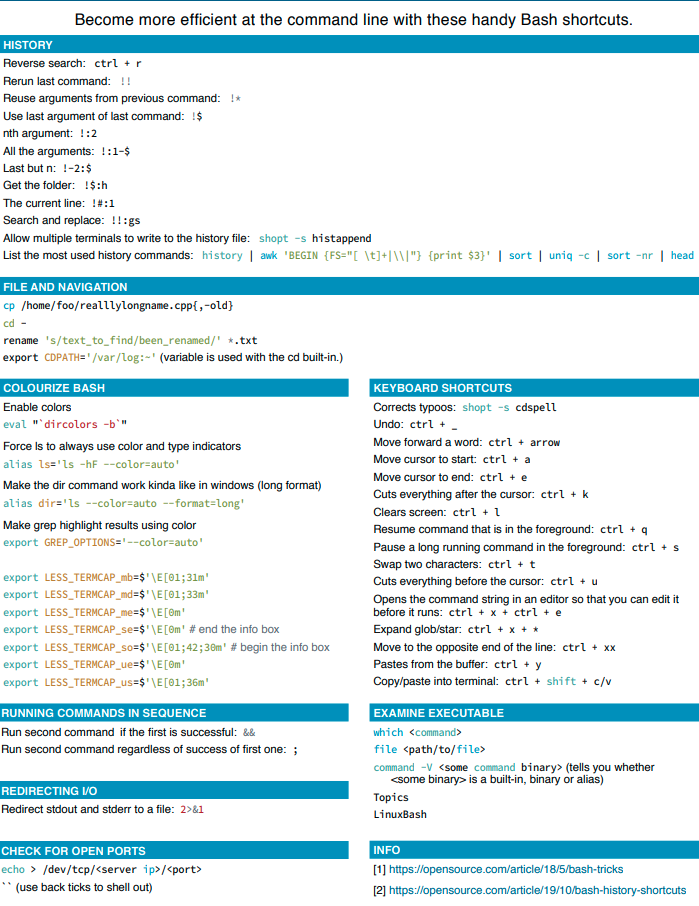

# devops
A few devops concepts I learn

## Resources

[Awesome Prometheus Resources](https://github.com/roaldnefs/awesome-prometheus) 

[Linux Interview Questions and Answers](https://www.youtube.com/watch?v=p3tvtXOg5rg) 

[How to change default SSH port](https://www.ubuntu18.com/ubuntu-change-ssh-port/) 

[Installing elk stack on Ubuntu >= 18.04](https://www.digitalocean.com/community/tutorials/how-to-install-elasticsearch-logstash-and-kibana-elastic-stack-on-ubuntu-18-04) 
 

[Securing Nginx with Let's Encrypt on Ubuntu >= 18.04](https://www.digitalocean.com/community/tutorials/how-to-secure-nginx-with-let-s-encrypt-on-ubuntu-18-04)
 

[Installing Nginx on Ubuntu >= 18.04](https://www.digitalocean.com/community/tutorials/how-to-install-nginx-on-ubuntu-18-04)
 

[How To Install and Use Docker on Ubuntu 18.04](https://www.digitalocean.com/community/tutorials/how-to-install-and-use-docker-on-ubuntu-18-04)
 

[HackerRank Interview Preparation Kit](https://www.hackerrank.com/interview/interview-preparation-kit) 

 ## Commands

`rm -r directory1` - deletes directory1 and its contents from file system  

`cat file1` - display contents of file1 in term  

`shopt -s histappend` - allows multiple sessions to write to history at the same time 

`!!` - repeats the most recent command 

`ctrl + r` - does a reverse search of terminal history 

`ctrl + _` - undo  

`bash cheatsheet`  

`curl -X POST -d 'json={"foo":"bar"}' http://URL/example.cgi` - post data defined in json to a given URL
 

`ip addr show eth0 | grep inet | awk '{ print $2; }' | sed 's/\/.*$//'` or `curl -4 icanhazip.com` - get a server's IP addresses from bash 

`nslookup server1` - get ip address for server1 

`systemctl start service1` - start service1 

`systemctl restart service1` - restart service1 

`systemctl reload service1` - reload service1 (for example: nginx) without dropping connections after making configuration changes 

`systemctl enable service1` - automatically start 'service1' whenever the server boots up. Use `systemctl disable service1` to disable this behavior 

`systemctl stop service1` - stop service1 

`openssl req -x509 -newkey rsa:4096 -sha256 -days 3650 -nodes -keyout example.key -out example.crt -subj "/CN=example.com" -addext "subjectAltName=DNS:example.com,DNS:www.example.net,IP:10.0.0.1"` - generate self signed certificate using openssl 

### Git commands

`git reset --hard HEAD~1` - gets you back by one commit
